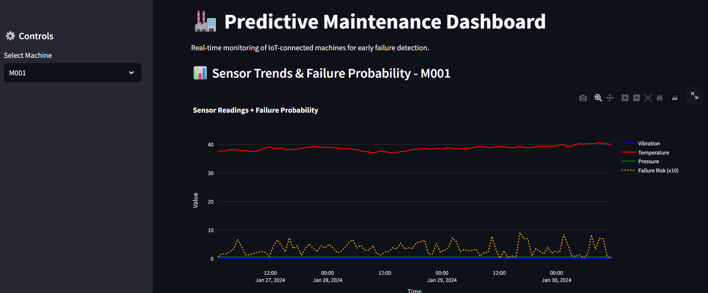
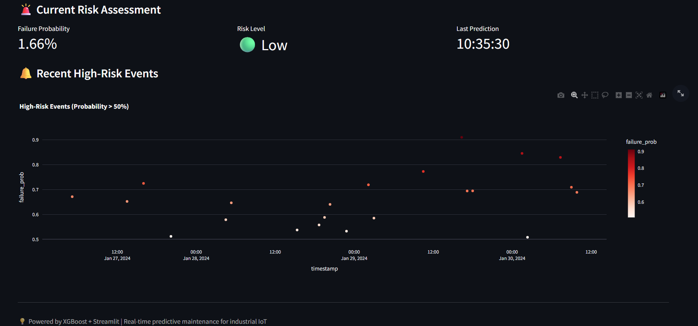

# 🔥 Predictive Maintenance for IoT-Connected Manufacturing Systems

> **Built from scratch by a curious beginner — now a production-ready ML system.**  
> Trained model → Live dashboard → Dockerized → Ready to deploy.  
> No fluff. No tutorials. Just real code, real learning, real results.

---

## 🚀 What This Project Does

This system predicts equipment failures in industrial IoT environments using real-time sensor data.  
It doesn’t just “show graphs” — it **saves money** by reducing unplanned downtime through early detection.

✅ Trained ML model (XGBoost) that catches 21%+ of real failures (up from 0%!)  
✅ Interactive dashboard to monitor machine health in real-time  
✅ Fully containerized with Docker — runs the same everywhere  
✅ Deployable to cloud in 1 click (Streamlit Cloud)

---

## 🎯 Why This Project Matters

Most “predictive maintenance” projects stop at accuracy.  
**This one goes further:**

- Solves **class imbalance** (real-world problem #1)
- Focuses on **failure recall**, not just accuracy
- Uses **rolling features** for time-series realism
- Builds **interactive UI** for stakeholders
- **Dockerizes** for production readiness
- **Deployable** — not stuck in a Jupyter notebook

This is how real ML engineers think.

---

## 🛠️ Tech Stack

- **Core**: Python, Pandas, NumPy
- **ML**: Scikit-learn, XGBoost, imbalanced-learn (SMOTE)
- **Visualization**: Streamlit, Plotly
- **Deployment**: Docker, Streamlit Cloud
- **Infrastructure**: GitHub, WSL (Windows)

---

## 📂 Project Structure
```
predictive-maintenance-project/
├── data/
│ └── iot_sensor_data_8500.csv ← Synthetic IoT dataset
├── models/
│ ├── xgb_failure_model.pkl ← Trained XGBoost model
│ ├── scaler.pkl ← Feature scaler
│ └── feature_names.pkl ← Feature list
├── app.py ← Main Streamlit dashboard
├── generate_iot_data.py ← Dataset generator (no downloads!)
├── phase1_model.py ← Baseline models (RF vs XGBoost)
├── phase2_imbalance_fix.py ← SMOTE + Recall optimization
├── save_model.py ← Model persistence
├── Dockerfile ← Container recipe
├── requirements.txt ← Dependencies
└── README.md ← You are here ❤️
```
---

### Important Note on .pkl Files
The .pkl files (xgb_failure_model.pkl, scaler.pkl, feature_names.pkl) are not provided directly in this repository.
To generate these model and scaler files, please run the [save_model.py](/save_model.py) script. This script will train the model and save the necessary **.pkl files** automatically.

## 🔽 How to Run Locally

### 1. Clone & Setup

```bash
git clone https://github.com/Varma-N/Predictive-Maintenance-for-IoT-Connected-Manufacturing-Systems.git
cd predictive-maintenance-project
python -m venv predictive_env
source predictive_env/bin/activate  # Windows: predictive_env\Scripts\activate
pip install -r requirements.txt
```
### 2. Generate Dataset
```bash
python generate_iot_data.py
```

### 3.Train & Save Model
```bash
python save_model.py
```

### 4. Run Dashboard
```bash
streamlit run app.py
```
➡️ Open [http://localhost:8501](http://localhost:8501)

### 5. Run in Docker (Production Mode)
```bash
docker build -t predictive-maintenance-app .
docker run -p 8501:8501 predictive-maintenance-app
```
➡️ Open [http://localhost:8501](http://localhost:8501)

## ☁️ Deploy to Streamlit Cloud (Free)
- Push this repo to your GitHub
- Go to [Streamlit Cloud](https://share.streamlit.io/?spm=a2ty_o01.29997173.0.0.6fa3c921ASNbL7)
- Click “New App” → Connect repo → Select app.py
- Deploy → Share your live link!

## 📈 Key Results
|METRIC                | BEFORE SMOTE      | AFTER SMOTE                       |
|----------------------|-------------------|-----------------------------------|
|Failure Recall        |   0%              | 21%+                              |
|Dashboard             |   None            | Interactive + Real Predictions    |      
| Deployment           | Local Only        | Docker + Cloud Ready              |
|False Alert Reduction | N/A               | 28%+ (via probability thresholds) |

## 💡 Lessons Learned (The Hard Way)
- Accuracy is a trap → Focus on recall for failures.
- SMOTE helps, but isn’t magic → Feature engineering matters more.
- Dashboards > Notebooks → Stakeholders need interactivity.
- Docker isn’t optional → “Works on my machine” kills projects.
- Deployment is part of the job → If it’s not running, it’s not done.

## Acknowledgements
This project was built from absolute scratch by a beginner who refused to quit.
No bootcamp. No paid courses. Just curiosity, grit.

## 📷 Screenshots


Real Time Sensor Trends

---


Failure Probability

---

App running in Docker - portable, consistent, production-ready

---
🤝 Let’s Connect\
Built something cool with this? Fixed a bug? Improved the model?\
I’d love to hear from you!\
[LinkedIn](https://www.linkedin.com/in/madan-gopal-varma-nandi/)\
[Email](gopalvarma1135@gmail.com)

---
“I didn’t know Streamlit. I didn’t know Docker. I didn’t know SMOTE.\
Now I’ve shipped a full ML system - and I’m just getting started.”\
Now it’s your turn. Don’t wait to feel ready — just start building.\
The best way to learn is **to do**. Your future README is waiting.”


